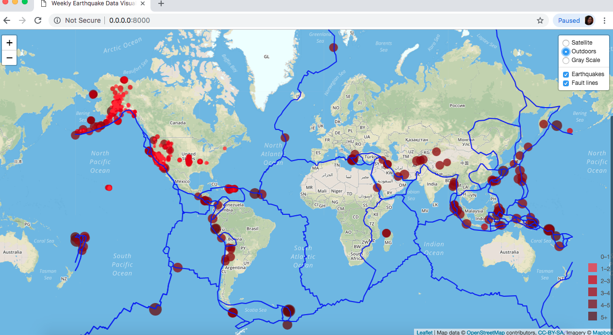

# Visualizing-Data-with-Leaflet
visualizing earthquake data  using Leaflet and JavaScript.
The realtime earthquake data for a week is extracted from USGS site in a geoJSON format.
The data is then plotted on live map platform or MAPBOX api.

The various ranges of color indicates the intensity of the magnitude as defined in the legend.
The size of the marker along with the popup is based on the location of the earthquake and its magnitude(radius) multiplied by 2.

author: Chol K. Gurung
